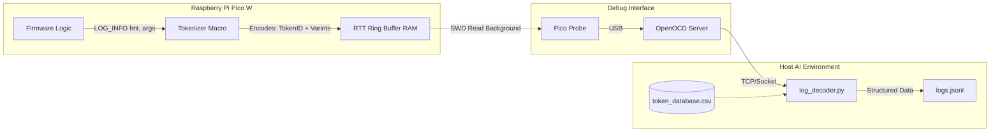

# Tokenized Logging Subsystem Architecture

## 1. Objective

Enable "Headless" AI-driven development on the Raspberry Pi Pico W by providing a high-performance, structured logging system. This subsystem solves the problem of "Heisenbugs" caused by blocking UART logging and enables the Host A.I. to parse execution data reliably via JSON, maintaining real-time system integrity.

## 2. Core Philosophy: Tokenized & Buffered

The foundational design decision is to completely decouple string formatting from the microcontroller.

### Why This Approach?

- **Zero Latency:** RTT write operations take <1μs per call (memory copy), compared to milliseconds for UART/printf, preventing FreeRTOS timing violations.
- **AI-Native Data:** Logs are transmitted as binary tokens and reconstructed on the host into structured JSON objects (e.g., `{"event": "MOTOR_START", "rpm": 1200}`), eliminating error-prone regex parsing.
- **Crash Resilience:** Data is stored in a RAM Ring Buffer, allowing GDB to recover the "Black Box" history post-mortem even after a hard fault.

## 3. Technical Architecture

### A. Transport Layer (SEGGER RTT)

- **Role:** Handles the physical movement of bytes from Firmware to Host without CPU intervention.
- **Interface:** Writes to a global `_SEGGER_RTT` control block in RAM.
- **Constraints:**
  - ⚠️ MANDATORY: Must use Channel 0 (Terminal 0) for the primary stream.
  - ⚠️ MANDATORY: Must be initialized early in `main()` before any tasks start.

### B. Serialization Layer (Lightweight Tokenizer)

- **Role:** Converts usage of `LOG_INFO(...)` macros into compact 4-byte Token IDs at compile time.
- **Interface:** Python pre-build script (`gen_tokens.py`) generates `tokens_generated.h`.
- **Constraints:**
  - ⚠️ MANDATORY: Every build must regenerate the token database (`token_database.csv`).
  - ⚠️ MANDATORY: The first log message MUST include the `BUILD_ID` hash.

### C. Host-Side Decoder

- **Role:** Reconstructs the binary stream into human/AI-readable JSON.
- **Interface:** PyLink or direct Socket connection to OpenOCD.
- **Constraints:**
  - ⚠️ MANDATORY: Implementation must halt if received `BUILD_ID` does not match local CSV.

### System Interaction Diagram



## 4. Data Structures & Encoding

### Log Packet Format

| Field | Type | Size | Notes |
|-------|------|------|-------|
| Token ID | `uint32_t` | 4 Bytes | Little-endian hash of the format string. |
| Arguments | `varint` | Variable (1-10B) | Arguments encoded using ZigZag Varint encoding. |

### Encoding Efficiency Rules

| Data Type | Encoding Strategy | Typical Size | Notes |
|-----------|------------------|--------------|-------|
| `int` (Small) | ZigZag Varint | 1 Byte | Values -64 to 63 fit in 1 byte. |
| `int` (Large) | ZigZag Varint | 3-5 Bytes | Optimized for small values typically found in logs. |
| `float` | Raw `IEEE754` | 4 Bytes | No compression for floats to save CPU cycles. |
| `string` | Length-Prefixed | 1B + Len | Not recommended; prefer static tokens. |

## 5. Implementation Strategy

### Directory Structure

```text
freeRtos-ai-optimized-codebase/
    components/
        logging/
            include/
                ai_log.h          # Public API: macros for logging
                tokens_generated.h # Auto-generated hash map
            src/
                SEGGER_RTT.c      # Vendor implementation
                log_core.c        # Init and critical sections
    tools/
        logging/
            gen_tokens.py         # Scanner & CSV generator
            log_decoder.py        # Host stream processor
```

### Execution Sequence

1. **Build Phase** — `gen_tokens.py` scans source, updates `token_database.csv`, creates `tokens_generated.h`.
2. **Compile** — Firmware compiles with the new Token IDs.
3. **Flash & Run** — Host flashes binary. Decoder script starts listening on OpenOCD port.
4. **Boot Handshake** — Firmware sends `LOG_INFO("BUILD_ID: %x", HASH)`. Decoder validates.
5. **Runtime Logging** — Continuous stream of tokenized packets.

### Integration Points

- **FreeRTOS:** Logging calls must be wrapped in `taskENTER_CRITICAL()` / `taskEXIT_CRITICAL()` to ensure thread safety of the RTT buffer pointers.
- **Testing Framework:** GDB scripts must be able to locate `_SEGGER_RTT` symbol to dump logs on crash.

## 6. Agent Implementation Checklist

When implementing this specification, the agent **MUST**:

- [ ] Implement `gen_tokens.py` to auto-run via CMake `add_custom_command`.
- [ ] Implement `log_decoder.py` with ZigZag Varint support.
- [ ] Ensure the first log call in `main()` is the Build ID.
- [ ] Verify `token_database.csv` is **Tracked in Git** to sync between Host/Device.
- [ ] Emit structured validation: `{"status": "complete", "component": "logging_subsystem"}`.

## 7. Validation Criteria

Define "done" for this component:

| Check | Method | Expected Result |
|-------|--------|-----------------|
| **Zero Interference** | Logic Analyzer / GPIO | Pin toggle around `LOG_INFO` shows < 2μs width. |
| **Data Integrity** | Run `log_decoder.py` | Receives correct "Hello World" and matches Build ID. |
| **Crash Dump** | Trigger HardFault | GDB `x/100b &_SEGGER_RTT` shows valid data in RAM. |
