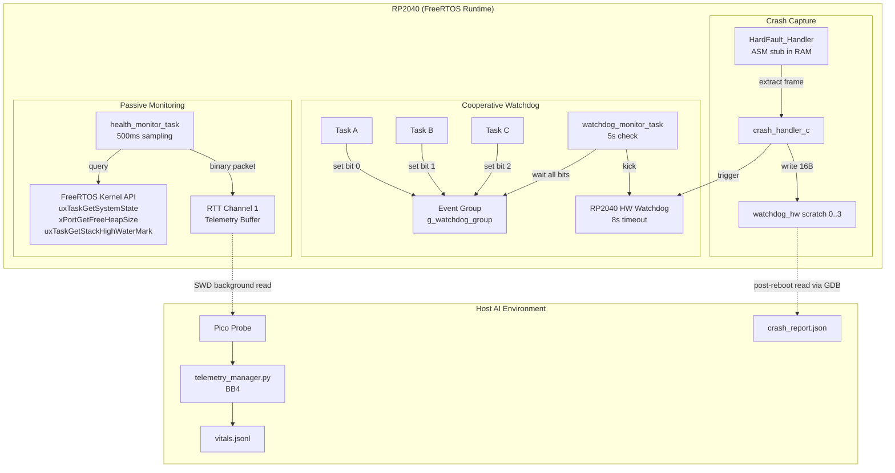

# Health & Observability Subsystem Architecture — Building Block 5

## 1. Objective
Expose high-fidelity, machine-readable internal states of the RP2040 FreeRTOS system to enable an AI Agent to autonomously detect task starvation, memory leaks, stack overflows, and crash root-causes. This subsystem transforms opaque "the Pico froze" failures into structured, actionable data packets (JSON) containing exact fault addresses, guilty task IDs, and system health trends, closing the autonomous debugging loop without human intervention.

## 2. Core Philosophy: Passive Observation with Active Fault Capture
Three pillars cover the full failure timeline:

*   **Passive Health Monitoring:** 500ms vitals sampling → RTT Channel 1 (BB4 transport). Detects leaks/starvation via trend analysis *before* failure.
*   **Cooperative Watchdog:** Event Group-based liveness proof per task → feeds RP2040 HW watchdog. Detects hung tasks in ≤8s.
*   **Active Fault Capture:** HardFault handler writes CPU state to `watchdog_hw->scratch[0..3]` (survives reboot). Zero runtime cost until a fault fires.

### Why This Approach?
- **[Zero Interference]:** All paths use RTT (< 1μs) or memory writes. No UART/printf, no scheduler dependency in fault path.
- **[Survives the Crash]:** Scratch registers persist through watchdog reboot. No flash writes in fault context.

## 3. Technical Architecture

### A. FreeRTOS Observability Engine <sup>[[docs](https://www.freertos.org/Documentation/02-Kernel/04-API-references/03-Task-utilities/00-Task-utilities)]</sup>

- **Role:** Periodically sample FreeRTOS kernel internals (heap, stack watermarks, per-task CPU usage) and encode them as structured binary packets for the Telemetry Driver (BB4, RTT Channel 1).
- **Interface:** Dedicated `health_monitor_task` running at `tskIDLE_PRIORITY + 1`, sampling every 500ms.
- **Constraints:**
  - ⚠️ MANDATORY: Use `uxTaskGetSystemState()` for production telemetry, **NOT** `vTaskGetRunTimeStats()`. The latter disables interrupts for the entire formatting duration and will cause timing violations in WiFi/I2C tasks.
  - ⚠️ MANDATORY: Encode per-task stats as binary (Token ID + varints per BB2 encoding) — never format strings on-device.
  - ⚠️ MANDATORY: All `FreeRTOSConfig.h` macros listed in Section 4 must be set.
- **References:** [FreeRTOS Runtime Stats](https://www.freertos.org/Documentation/02-Kernel/04-API-references/03-Task-utilities/02-uxTaskGetSystemState)

### B. Cooperative Watchdog System <sup>[[docs](https://www.raspberrypi.com/documentation/pico-sdk/hardware.html#group_hardware_watchdog)]</sup>

- **Role:** Prove that every registered critical task is executing within its deadline. If any task fails to check in, identify the guilty task and allow the hardware watchdog to reset the system.
- **Interface:** FreeRTOS Event Group bitmask. Each task calls `xEventGroupSetBits(g_watchdog_group, MY_TASK_BIT)` in its main loop.
- **Architecture:** Two-tier timeout:
  - **Software tier (Monitor Task):** Runs at `configMAX_PRIORITIES - 1`. Every 5 seconds, calls `xEventGroupWaitBits()` for all registered task bits with `pdTRUE` (auto-clear) and `pdTRUE` (wait-for-all). On success → `watchdog_update()`. On timeout → log guilty bits to scratch registers, let HW watchdog fire.
  - **Hardware tier (RP2040 Watchdog):** Configured at 8 seconds (maximum safe value due to RP2040-E1 errata). Catches a hung monitor task or ISR-level lockup.
- **Constraints:**
  - ⚠️ MANDATORY: Maximum 24 monitored tasks (Event Group bit width on 32-bit architecture with `configUSE_16_BIT_TICKS = 0`). Realistically, 4-8 critical tasks.
  - ⚠️ MANDATORY: `watchdog_enable(WDT_TIMEOUT_MS, true)` — the `true` parameter pauses the watchdog during JTAG/SWD debug sessions to prevent resets while the Pico Probe is attached.
  - ⚠️ MANDATORY: Do **NOT** use `watchdog_hw->scratch[4..7]` — these are reserved by the Pico SDK for reboot targeting.
- **References:** [RP2040 Datasheet §4.7 Watchdog](https://datasheets.raspberrypi.com/rp2040/rp2040-datasheet.pdf)

### C. Structured Crash Handler ("JSON Panic") <sup>[[datasheet](https://datasheets.raspberrypi.com/rp2040/rp2040-datasheet.pdf)]</sup>

- **Role:** Capture the complete CPU state at the moment of a HardFault and persist it across a watchdog reboot, transforming "the Pico froze" into "Task X crashed at address 0x1000ABCD, called from 0x1000EF00."
- **Interface:** Custom `HardFault_Handler` (ASM stub → C formatter). On next boot, `crash_reporter_init()` reads scratch registers and emits a JSON crash report to RTT and/or LittleFS (BB4).
- **Constraints:**
  - ⚠️ MANDATORY: The HardFault handler ASM stub **must** use Thumb-1 compatible instructions only (Cortex-M0+ has no IT blocks, no CBZ/CBNZ, low registers R0-R7 only).
  - ⚠️ MANDATORY: The handler **must** be placed in RAM using `__not_in_flash_func()` or `__attribute__((section(".time_critical.hardfault")))`. If flash/XIP is corrupted, a flash-resident handler will double-fault.
  - ⚠️ MANDATORY: No flash writes in the fault handler. Persist data to `watchdog_hw->scratch[0..3]` (16 bytes, survives watchdog reboot), then trigger `watchdog_reboot()`.
  - ⚠️ MANDATORY: Detect active stack via EXC_RETURN value in LR: `IF (LR & 0x4) THEN use PSP ELSE use MSP`.
  - ⚠️ MANDATORY: Each core has its own HardFault vector. Encode `core_id` (from `get_core_num()`) in crash data.
  - ⚠️ NOTE: Cortex-M0+ has no CFSR — all faults escalate to HardFault. Fault type inferred post-mortem from stacked PC via `crash_decoder.py`.

### System Interaction Diagram



## 4. Data Structures & Encoding

### FreeRTOSConfig.h — Required Macros
| Macro | Value | Purpose |
|-------|-------|---------|
| `configUSE_TRACE_FACILITY` | `1` | Enables `uxTaskGetSystemState()`, task numbering |
| `configGENERATE_RUN_TIME_STATS` | `1` | Enables per-task CPU time counters |
| `configUSE_STATS_FORMATTING_FUNCTIONS` | `1` | Enables `vTaskGetRunTimeStats()` (debug only) |
| `configRECORD_STACK_HIGH_ADDRESS` | `1` | Records stack start address in TCB |
| `configCHECK_FOR_STACK_OVERFLOW` | `2` | Method 2: pattern-based stack overflow detection |
| `INCLUDE_uxTaskGetStackHighWaterMark` | `1` | Enables stack watermark API |
| `INCLUDE_xTaskGetIdleTaskHandle` | `1` | Enables idle task runtime queries |
| `INCLUDE_xTaskGetCurrentTaskHandle` | `1` | Enables current task handle retrieval (for crash handler) |
| `INCLUDE_eTaskGetState` | `1` | Enables task state queries |
| `portCONFIGURE_TIMER_FOR_RUN_TIME_STATS()` | `/* no-op */` | RP2040's 1 MHz timer is initialized by SDK |
| `portGET_RUN_TIME_COUNTER_VALUE()` | `time_us_32()` | Returns microsecond counter (1000× tick rate) |

> `time_us_32()` wraps at ~71 min. Acceptable for delta-based CPU% calculations. For absolute runtime > 1hr, set `configRUN_TIME_COUNTER_TYPE` to `uint64_t`.

### Health Vitals Packet (Binary — RTT Channel 1)
Extends BB4 Telemetry Vitals format. Each packet = system header + N per-task entries.

| Field | Type | Size | Notes |
|-------|------|------|-------|
| `packet_type` | `uint8_t` | 1B | `0x01` = system vitals, `0x02` = per-task stats |
| `timestamp` | `uint32_t` | 4B | `xTaskGetTickCount()` |
| `free_heap` | `uint32_t` | 4B | `xPortGetFreeHeapSize()` |
| `min_free_heap` | `uint32_t` | 4B | `xPortGetMinimumEverFreeHeapSize()` |
| `task_count` | `uint8_t` | 1B | `uxTaskGetNumberOfTasks()` |
| — *per task:* | | 8B × N | Repeated for each task: |
| `.task_number` | `uint8_t` | 1B | `TaskStatus_t.xTaskNumber` |
| `.state` | `uint8_t` | 1B | 0=Run, 1=Ready, 2=Blocked, 3=Suspended, 4=Deleted |
| `.priority` | `uint8_t` | 1B | Current priority |
| `.stack_hwm` | `uint16_t` | 2B | Stack high water mark (words remaining) |
| `.cpu_pct` | `uint8_t` | 1B | CPU usage 0-100% |
| `.runtime_counter` | `uint16_t` | 2B | Truncated runtime (ms, wrapping) |

### Watchdog Scratch Register Layout (Crash Data)
Usable registers: `scratch[0..3]` only — `scratch[4..7]` reserved by Pico SDK.

| Register | Content | Encoding |
|----------|---------|----------|
| `scratch[0]` | Magic sentinel | `0xDEADFA11` = valid crash data present |
| `scratch[1]` | Stacked PC | Fault instruction address (32-bit) |
| `scratch[2]` | Stacked LR | Caller return address (32-bit) |
| `scratch[3]` | Packed metadata | `[xPSR bits 31:16 (16b)] | [core_id (4b)] | [task_number (12b)]` |

## 5. Implementation Strategy

### Directory Structure
```text
freeRtos-ai-optimized-codebase/
    components/
        health/
            include/
                health_monitor.h      # Public API: init, register_task, get_vitals
                watchdog_manager.h    # Public API: init, register_task, checkin
                crash_handler.h       # Public API: init, get_last_crash
                crash_handler_asm.S   # Thumb-1 HardFault stub
            src/
                health_monitor.c      # Vitals sampling task + binary encoding
                watchdog_manager.c    # Event group + HW watchdog orchestration
                crash_handler.c       # C-level crash data extraction + scratch write
                crash_reporter.c      # Post-reboot: read scratch → JSON → RTT/LittleFS
    tools/
        health/
            crash_decoder.py          # Host-side: parse crash JSON + addr2line lookup
            health_dashboard.py       # Host-side: parse vitals stream for AI summary
```

### Execution Sequence
1. **FreeRTOSConfig.h Update** — Add all macros from Section 4 table. `Depends on: existing FreeRTOS port`
2. **Crash Handler (ASM + C)** — Implement `HardFault_Handler` in Thumb-1 ASM → `crash_handler_c()`. Place in RAM. Write to scratch registers. `Depends on: linker script RAM section, pico SDK watchdog API`
3. **Crash Reporter** — Implement `crash_reporter_init()`: on boot, check `scratch[0]` magic → extract data → write to LittleFS (`/crash/latest.json`) and emit via RTT. `Depends on: BB4 LittleFS, BB2 RTT`
4. **Watchdog Manager** — Create Event Group, register tasks, implement monitor task with 5s cadence, configure HW watchdog at 8s. `Depends on: FreeRTOS event groups, pico SDK watchdog`
5. **Health Monitor Task** — Implement 500ms sampling using `uxTaskGetSystemState()`, encode as binary packets, write to RTT Channel 1. `Depends on: BB4 RTT Channel 1, BB2 tokenized encoding`
6. **Host-Side Tooling** — Implement `crash_decoder.py` (uses `arm-none-eabi-addr2line` to resolve PC/LR to source file:line). Extend `telemetry_manager.py` (BB4) to parse `0x02` per-task packets. `Depends on: BB4 telemetry_manager.py, Docker toolchain`

### Integration Points
| Block | Interface | Detail |
|-------|-----------|--------|
| **BB1 (Testing)** | `test_results_t` mailbox | Add `watchdog_triggered` field for HIL watchdog-reset detection |
| **BB2 (Logging)** | RTT Channel 0 + `LOG_INFO` macros | Health monitor uses tokenized logging; crash reporter emits JSON via log stream |
| **BB3 (DevOps/HIL)** | Docker + GDB scripts | `crash_decoder.py` needs `arm-none-eabi-addr2line`; GDB reads `scratch[0..3]` post-crash |
| **BB4 (Telemetry)** | RTT Channel 1 + LittleFS | Vitals → Channel 1 binary packets; crash reports → `/crash/latest.json` via `safe_flash_op` |

## 6. Agent Implementation Checklist
When implementing this specification, the agent **MUST**:

- [ ] Set all `FreeRTOSConfig.h` macros from Section 4.
- [ ] Implement `HardFault_Handler` as naked Thumb-1 ASM (`crash_handler_asm.S`) → C function. Place in RAM via `__not_in_flash_func()`.
- [ ] Implement `crash_reporter_init()` as the **first call** after `stdio_init_all()` in `main()`, before scheduler starts.
- [ ] Configure HW watchdog: `watchdog_enable(8000, true)`. Register monitor task at `configMAX_PRIORITIES - 1`.
- [ ] Encode health packets as binary (BB2 varint spec) to RTT Channel 1 (BB4 transport).
- [ ] Use BB4's `safe_flash_op` wrapper when writing crash reports to LittleFS.
- [ ] Emit structured validation: `{"status": "complete", "component": "health_observability_v1"}`

## 7. Validation Criteria
Define "done" for this component:

| Check | Method | Expected Result |
|-------|--------|-----------------|
| **Vitals Stream** | Read RTT Channel 1 via `telemetry_manager.py` | Valid heap/stack/CPU% packet every ~500ms |
| **Watchdog Fault Detection** | Inject `vTaskDelay(portMAX_DELAY)` in a monitored task | Resets within 8s. `watchdog_caused_reboot()` = true. Scratch contains guilty task bit |
| **HardFault Capture** | Trigger `*(volatile int*)0 = 0;` in a task | `scratch[0]` = `0xDEADFA11`, correct PC and task number |
| **Crash Persistence** | HardFault → reboot → read LittleFS | `/crash/latest.json` valid JSON with PC, LR, task info |
| **addr2line Resolution** | Feed crash PC to `crash_decoder.py` | Correct source file and line number |
| **RAM Placement** | `nm firmware.elf \| grep HardFault` | Symbol in SRAM (`0x2000xxxx`), not flash (`0x1000xxxx`) |

## References
1. [RP2040 Datasheet](https://datasheets.raspberrypi.com/rp2040/rp2040-datasheet.pdf) — Sections 2.4 (Cortex-M0+), 4.7 (Watchdog), 2.6.3 (SIO)
2. [FreeRTOS Task Utilities API](https://www.freertos.org/Documentation/02-Kernel/04-API-references/03-Task-utilities/00-Task-utilities) — `uxTaskGetSystemState`, `uxTaskGetStackHighWaterMark`
3. [FreeRTOS Runtime Stats](https://www.freertos.org/Documentation/02-Kernel/04-API-references/03-Task-utilities/02-uxTaskGetSystemState) — Configuration and usage
4. [Pico SDK Hardware Watchdog](https://www.raspberrypi.com/documentation/pico-sdk/hardware.html#group_hardware_watchdog) — `watchdog_enable`, `watchdog_update`, scratch registers
5. [SEGGER RTT](https://www.segger.com/products/debug-probes/j-link/technology/about-real-time-transfer/) — Transport for vitals stream
6. [ARM Cortex-M0+ Technical Reference Manual](https://developer.arm.com/documentation/ddi0484/latest/) — Exception model, stack frame layout
7. [LittleFS](https://github.com/littlefs-project/littlefs) — Power-loss resilient storage for crash reports

````
