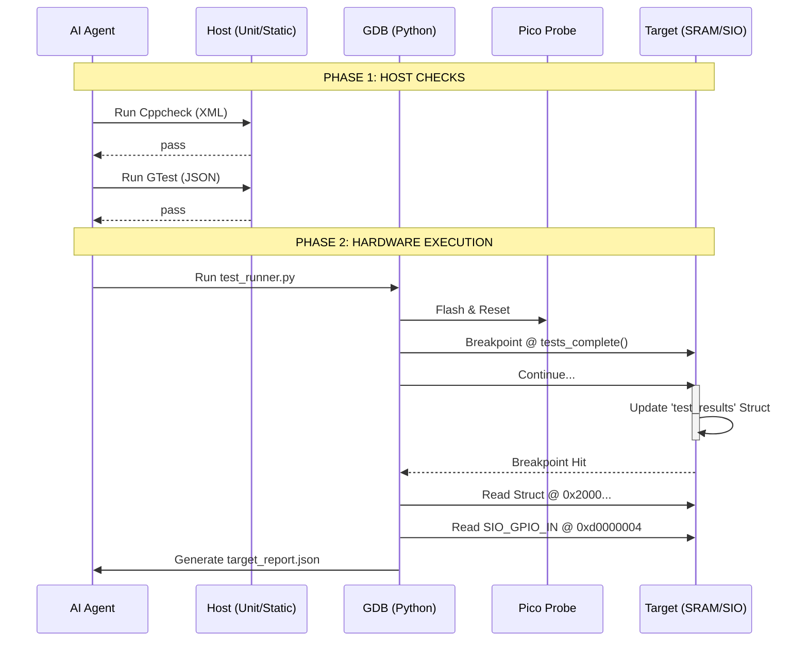

# AI-Optimized Testing & Validation Architecture for RP2040

## 1. Objective
Define the implementation blueprint for a "Headless" Testing & Validation subsystem on the Raspberry Pi Pico W. This architecture eliminates dependency on GUI debuggers and human inspection, enabling AI agents to autonomously compile firmware, validate logic via host-running unit tests, and verify system integration via hardware-in-the-loop debugging scripts.

## 2. Core Philosophy: Machine-Readable Observability
The codebase is designed primarily for **AI consumption**, not human reading.

### Why This Approach?
- **[Automated Remediation]:** AI Agents can parse JSON logs to fix bugs instantly, whereas they fail to parse unstructured "printf" text streams.
- **[Hardware Determinism]:** Using Shared Memory (Mailbox) instead of UART prevents ISR blocking and race conditions during WiFi/I2C testing.
- **[Host-First Iteration]:** Moving logic tests to the Host PC reduces the "Flash-Run-Fail" cycle from 20s to <100ms.

## 3. Technical Architecture

### A. Unit Testing Layer <sup>[[repo](https://github.com/google/googletest)]</sup>
- **Role:** Pure logic verification on the Host Machine.
- **Interface:** CLI Execution → JSON Output parameter.
- **Constraints:**
  - ⚠️ MANDATORY: Tests must use `--gtest_output=json:report.json`.
  - ⚠️ MANDATORY: Hardware headers (`pico/stdlib.h`) must be mocked for Host compilation.
- **References:** [GoogleTest User's Guide](https://google.github.io/googletest/)

### B. Static Analysis Layer <sup>[[docs](https://cppcheck.sourceforge.io/)]</sup>
- **Role:** Pre-compilation safety guardrails (MISRA-C compliance).
- **Interface:** XML Error Stream.
- **Constraints:**
  - ⚠️ MANDATORY: Enable `--xml --xml-version=2` for precise file/line targeting.
  - ⚠️ MANDATORY: Suppress `pico-sdk` warnings; focus strictly on user firmware.

### C. System Integration Layer <sup>[[datasheet](https://datasheets.raspberrypi.com/rp2040/rp2040-datasheet.pdf)]</sup>
- **Role:** Hardware-in-the-Loop validation of I/O (WiFi, I2C, GPIO).
- **Interface:** GDB-Multiarch + Python Scripting (No GUI).
- **Constraints:**
  - ⚠️ MANDATORY: Use **RP2040 SIO Registers** (`0xd0000004`) to verify GPIO states objectively.
  - ⚠️ MANDATORY: Use **OpenOCD** with `cmsis-dap` interface for the Debug Probe.

### System Interaction Diagram


## 4. Data Structures & Encoding

### The Result "Mailbox" (C Struct)
Located in SRAM. Populated by Firmware, Read by GDB.

| Field | Type | Size | Notes |
|-------|------|------|-------|
| `magic` | `uint32_t` | 4B | `0xCAFEBABE` |
| `fails` | `uint32_t` | 4B | Count of failed assertions |
| `wifi_state` | `uint8_t` | 1B | 0=Down, 1=Associated, 2=IP_Got |
| `i2c_ack` | `bool` | 1B | True if sensor responded |

### Hardware Truth (SIO Registers)
Read directly by GDB to bypass firmware logic updates.

| Name | Address | Description |
|------|---------|-------------|
| `SIO_GPIO_IN` | `0xd0000004` | Input value for all 30 GPIOs (Bitmask). |
| `SIO_GPIO_OUT` | `0xd0000010` | Output value driving pins. |

## 5. Implementation Strategy

### Directory Structure
```text
freeRtos-ai-optimized/
    src/
        common/        # Shared logic
        firmware/      # RP2040 specific code
    test/
        host/
            mocks/
            CMakeLists.txt
        target/
            runner.py  # GDB Automation
            structs.h  # Shared Mailbox Def
    resources/
        Testing_Validation_Architecture.md
```

### Execution Sequence
1.  **Static Guard**: `cppcheck src/firmware --xml`
2.  **Logic Guard**: `cd build/host && ctest --output-junit logic.xml`
3.  **HIL Execution**: `gdb-multiarch firmware.elf --batch -x test/target/runner.py`
4.  **Analysis**: Agent reads `logic.xml` and `target_report.json`.

### Integration Points
-   **OpenOCD Server**: Must be started with `openocd -f interface/cmsis-dap.cfg -f target/rp2040.cfg`.

## 6. Agent Implementation Checklist
When implementing this specification, the agent **MUST**:

- [ ] Install `openocd` (RPi fork) and `gdb-multiarch`.
- [ ] Create a `TestResult` struct in `src/common/structs.h`.
- [ ] Implement `runner.py` using `gdb.parse_and_eval()` to read the struct.
- [ ] Configure `CMakeLists.txt` to exclude RP2040 hardware libs from Host build.
- [ ] Emit structured validation: `{"status": "architecture_defined", "component": "testing"}`

## 7. Validation Criteria
Define "done" for this component:

| Check | Method | Expected Result |
|-------|--------|-----------------|
| **Struct Visibility** | `nm firmware.elf | grep test_results` | Symbol exists. |
| **GDB Access** | `gdb -x check_gpio.py` | Returns integer value of SIO register. |
| **JSON Output** | `cat report.json` | Valid JSON structure. |
