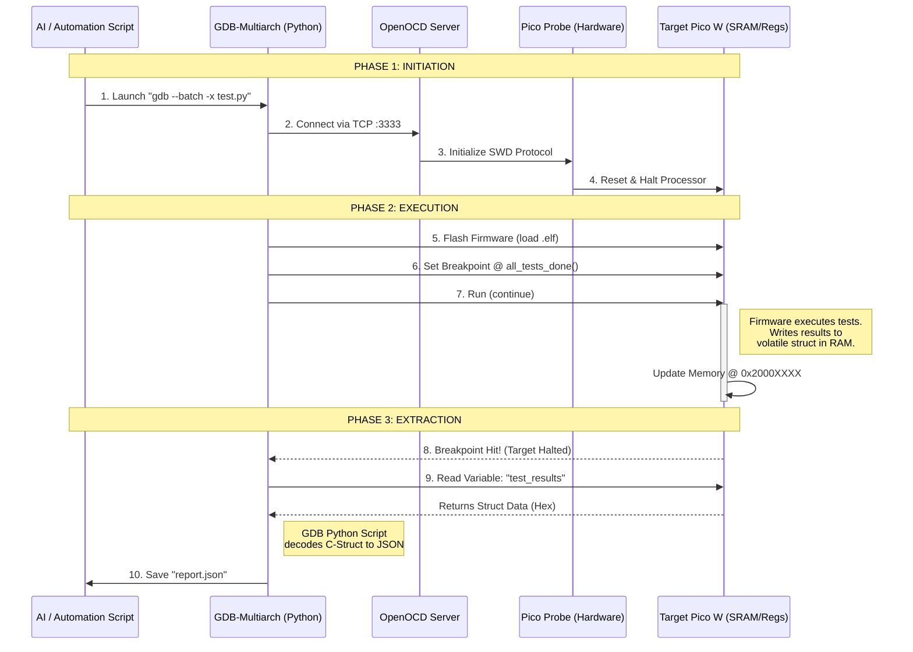

# AI-Optimized Debugging Architecture for RP2040

## Overview
This document outlines the data transfer flow between the Host System (AI/User), the Debugging Tools, and the Target Hardware (Raspberry Pi Pico W). The goal is to establish a "Headless" integration loop where an AI Agent can run hardware tests and receive structured, ground-truth data.

## The "Native" Stack
The system relies on the standard Raspberry Pi Pico toolchain:
1.  **Pico SDK:** For building the firmware.
2.  **OpenOCD (Raspberry Pi Fork):** Drivers for the Pico Probe (CMSIS-DAP).
3.  **GDB-Multiarch:** The debugger that allows Python scripting.

## Data Flow Graph
The following Mermaid graph illustrates how a test command propagates from the AI to the hardware and how the "Result Struct" travels back.



## Structure Definitions

### The Result "Mailbox" (C Code)
This structure resides in the RP2040's RAM. The compiler ensures it exists at a known location.

```c
// Located in main.c or test_runner.c
typedef struct {
    uint32_t magic_header;      // e.g., 0xDEADBEEF
    uint32_t tests_run;
    uint32_t tests_failed;
    bool     wifi_connected;    // 1 = Connected
    bool     i2c_sensor_ok;     // 1 = Sensor Replying
    char     error_msg[64];     // Last error string
} test_results_t;

volatile test_results_t results; 
```

### The Direct Hardware Read (GDB Python)
For validating GPIO states without trusting the firmware code, GDB reads the **SIO (Single-cycle IO)** registers directly.

*   **SIO Base Address:** `0xd0000000`
*   **GPIO Input Offset:** `0x00000004`
*   **Target Address:** `0xd0000004`

The AI script reads this 32-bit integer. If `Bit 25` is `1`, the LED is electrically High.

## Why this is "AI-Optimized"
1.  **Deterministic:** No parsing "log text" which might change. We read raw memory bytes.
2.  **Non-Blocking:** We do not slow down the WiFi stack with `printf` calls.
3.  **Ground Truth:** GDB can read hardware registers state even if the firmware crashes, telling us *why* it crashed (e.g., Stack Pointer out of bounds).
