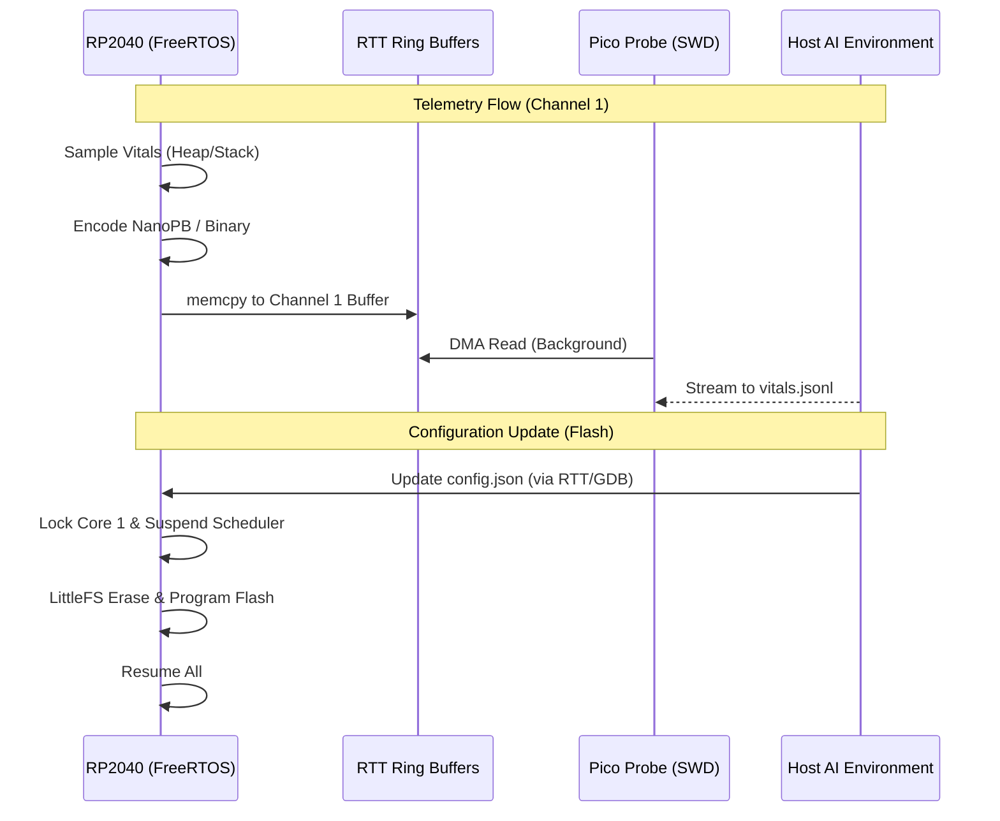

# Data Persistence & Telemetry Architecture — Building Block 4

## 1. Objective
Establish a high-fidelity, machine-readable observability and configuration link between the RP2040 and the Host AI. This subsystem enables the AI Agent to perform real-time logic tuning (Persistence) and predictive health analysis (Telemetry) over a physical SWD-based cable link, ensuring developability without the complexity of a network stack.

## 2. Core Philosophy: The "Zero-Invasive" Cable Link
The design prioritizes stability and timing integrity by decoupling diagnostic data from application logic.

*   **SWD Memory-Mapped Telemetry:** Uses SEGGER RTT to stream data via background memory access, causing <1μs of CPU overhead.

*   **Decoupled Channels:** Reserves dedicated RTT channels for Logs vs. Vitals to prevent data corruption or "crowding."
*   **Atomic Persistence:** Uses LittleFS to ensure configuration updates are power-loss safe.

### Why This Approach?
- **[Predictive Maintenance]:** Monitoring Heap and Stack "Watermarks" allows the AI to flag memory leaks (slope analysis) minutes before a crash occurs.
- **[Jitter-Free Debugging]:** Unlike USB or UART, RTT does not block the CPU or require interrupts, preserving the deterministic behavior of the FreeRTOS scheduler.
- **[No Extra Hardware]:** Leverages the existing Pico Probe (SWD) used for flashing and debugging.

## 3. Technical Architecture

### A. Persistence Layer (LittleFS) <sup>[[repo](https://github.com/littlefs-project/littlefs)]</sup>
- **Role:** Power-loss resilient storage for AI-tunable configurations.
- **Interface:** POSIX-like file API (`/config/app.json`).
- **Constraints:** 
  - ⚠️ MANDATORY: **SMP Flash Guard Wrapper.** Writing to flash pauses the XIP (Execute-In-Place) bus.
  - ⚠️ MANDATORY: Must use `multicore_lockout_start_blocking()` to pause the second core during sector erase/program.
- **Implementation:** `fs_manager.c` handles JSON (cJSON) serialization of configuration structures.

### B. Telemetry Driver (SEGGER RTT) <sup>[[docs](https://www.segger.com/products/debug-probes/j-link/technology/about-real-time-transfer/)]</sup>
- **Role:** High-speed, non-blocking transport for system vitals.
- **Interface:** `RTT_Write(CHANNEL_TELEMETRY, payload, len)`.
- **Channels:**
    - **Channel 0:** Tokenized Logging (Existing).
    - **Channel 1:** Telemetry Vitals (New).
- **References:** [RP2040 Flash Hardware API](https://raspberrypi.github.io/pico-sdk-doxygen/group__hardware__flash.html)

### C. Health Supervisor Task
- **Role:** Periodic (500ms) sampling of FreeRTOS internal states.
- **Metrics Collected:** 
    - `xPortGetFreeHeapSize()`
    - `uxTaskGetStackHighWaterMark()`
    - `vTaskGetRunTimeStats()`

### System Interaction Diagram


## 4. Data Structures & Encoding

### System Vitals Packet (Binary)
| Field | Type | Size | Notes |
|-------|------|------|-------|
| `timestamp` | `uint32_t` | 4B | Uptime in milliseconds. |
| `free_heap` | `uint32_t` | 4B | `xPortGetFreeHeapSize()` output. |
| `min_free_heap` | `uint32_t` | 4B | Low-watermark for heap health. |
| `task_watermarks` | `uint16_t[]` | 2B * N | Array of bytes remaining for each task stack. |

## 5. Implementation Strategy

### Directory Structure
```text
freeRtos-ai-optimized/
    components/
        persistence/
            src/
                fs_port_rp2040.c    # Flash lockout & HAL
                fs_manager.c        # Config parser
        telemetry/
            src/
                supervisor_task.c   # FreeRTOS data gathering
                rtt_telemetry.c     # Channel 1 management
```

### Execution Sequence
1. **Flash Guard Implementation** — Create the `safe_flash_op` wrapper using `multicore_lockout`. `Depends on: pico_multicore`
2. **LittleFS Integration** — Mount filesystem at boot and verify `/config` directory existence.
3. **Supervisor Task Setup** — Initialize RTT Channel 1 and start the telemetry task at `tskIDLE_PRIORITY + 1`.

## 6. Agent Implementation Checklist
When implementing this specification, the agent **MUST**:

- [ ] Wrap all LittleFS operations in a critical section that locks the dual-core bus.
- [ ] Initialize SEGGER RTT with a large enough buffer (min 1KB) for Channel 1 to prevent packet drops during bursts.
- [ ] Link `vConfigUpdate` callback to reload application parameters without a full reboot.
- [ ] Emit structured validation: `{"status": "complete", "component": "telemetry_vitals_v1"}`

## 7. Validation Criteria

| Check | Method | Expected Result |
|-------|--------|-----------------|
| XIP Crash Prevention | Program Flash while running a high-frequency interrupt on Core 1 | System remains stable/no HardFault |
| Memory Leak Detection | Artificially leak 4 bytes per second in a test task | AI detects negative slope in `vitals.jsonl` |
| Persistence Integrity | Cut power during a JSON write operation | Filesystem mounts successfully on next boot (LittleFS CoW) |