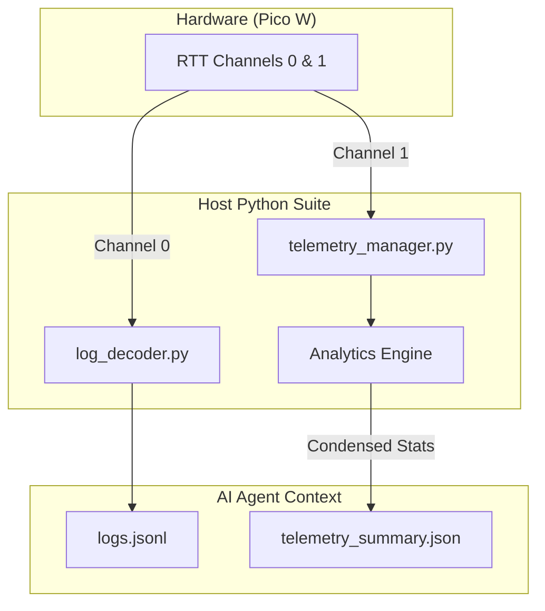

# AI-Optimized Host-Side Python Tooling Manifest

## 1. Objective
Define the suite of Python scripts required to bridge the physical RP2040 hardware with the AI Agent's context. These scripts transform raw hardware signals (SWD, RTT, JSON) into high-level, "AI-digestible" data while protecting the LLM from context-window exhaustion.

## 2. Core Tools Summary

### A. Logging & Decoding (Block 2)
| Script | Purpose | AI Value |
|-------|---------|----------|
| `gen_tokens.py` | Scans source code for `LOG_INFO` strings and generates a CSV database + C header. | Preserves binary efficiency on-device while giving AI a string look-up table. |
| `log_decoder.py` | Connects to OpenOCD/RTT, reads Token IDs, and reconstructs them into JSON. | Transforms binary blobs into a structured event stream the AI can reason about. |

### B. DevOps & Hardware-in-the-Loop (Block 3)
| Script | Purpose | AI Value |
|-------|---------|----------|
| `flash.py` | Wraps OpenOCD to handle binary flashing and verification. | Provides a single "Button" for the AI to deploy new code. |
| `run_hw_test.py` | Orchestrates a test run: Flashes, sets breakpoints, and reads the RAM "Mailbox" result. | Enables autonomous validation of physical logic (e.g., "Did the LED actually turn on?"). |
| `ahi_tool.py` | (Agent-Hardware Interface) Peek/Poke tool for reading SIO registers directly. | Allows AI to verify "Physical Truth" without trusting firmware-reported state. |

### C. Telemetry & Analytics (Block 4)
| Script | Purpose | AI Value |
|-------|---------|----------|
| `telemetry_manager.py` | **The Host Filter.** Connects to RTT Channel 1, samples at 500ms, and performs tiered analytics. | **Crucial:** Protects AI context by only reporting summarized trends or "Anomaly Alerts" (like a 10-minute heap leak slope). |
| `config_sync.py` | Syncs local `.json` configurations with the LittleFS filesystem on flash. | Allows the AI to "Hot-Swap" application parameters without a full re-compile/re-flash cycle. |

### D. Health & Observability (Block 5)
| Script | Purpose | AI Value |
|-------|---------|----------|
| `crash_decoder.py` | Parses crash JSON from RTT/LittleFS, uses `arm-none-eabi-addr2line` to resolve PC/LR to source:line. | Transforms raw crash addresses (`0x1000ABCD`) into actionable bug reports ("sensors.c:142: NULL dereference"). |
| `health_dashboard.py` | Extends `telemetry_manager.py` to parse BB5 per-task vitals (packet type `0x02`). Generates task-specific health reports. | Enables AI to pinpoint which task is leaking memory, which is CPU-starved, which stack is near overflow. Answers "who is guilty?" not just "system is unhealthy." |

## 3. Detailed Logic: `telemetry_manager.py` (The Health Filter)

To prevent the AI from being swamped by 120 samples per minute (500ms intervals), this script implements **State-Change Reporting**:

1.  **Passive Mode:** Records all 500ms samples to `telemetry_raw.jsonl` (for post-mortem analysis).
2.  **Summary Mode:** Every 5 minutes, it generates a single summarized line for the AI:
    - *Example:* `{"status": "nominal", "heap_slope": -0.01, "peak_stack_usage": "12%"}`
3.  **Alert Mode:** If a value crosses a critical threshold (e.g., `free_heap < 4096`), it injects an immediate high-priority alert into the AI's "Issues" feed.

## 4. Execution Workflow



## 5. Directory Structure for Tools
These tools should reside in the `tools/` directory of the project root to keep them separate from the MCU firmware.

```text
freeRtos-ai-optimized/
    tools/
        logging/
            gen_tokens.py
            log_decoder.py
        hil/
            flash.py
            run_hw_test.py
            ahi_tool.py
        telemetry/
            telemetry_manager.py
            config_sync.py
        health/
            crash_decoder.py
            health_dashboard.py
```
